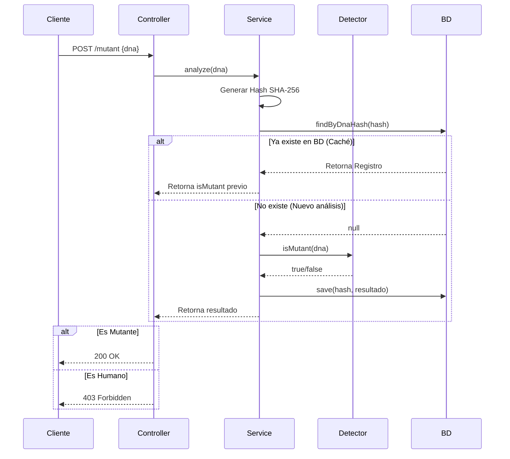

# Mutant Detector API


## Descripción del Proyecto

Magneto quiere reclutar la mayor cantidad de mutantes para luchar contra los X-Men. [cite_start]Este proyecto es una API REST desarrollada en **Spring Boot** que detecta si un humano es mutante basándose en su secuencia de ADN[cite: 2, 3].

El sistema verifica secuencias de ADN en una matriz de (NxN). [cite_start]Se considera mutante si se encuentra **más de una secuencia de cuatro letras iguales** de forma oblicua, horizontal o vertical[cite: 13, 44].

---

## Despliegue en la Nube (Demo en Vivo)

[cite_start]La API se encuentra desplegada y disponible para pruebas en **Render** (Nivel 2 del examen)[cite: 22, 48].

**Base URL:** `[TU_URL_DE_RENDER]`
**Swagger UI (Documentación Interactiva):** `[TU_URL_DE_RENDER]/swagger-ui.html`

> **Nota:** Al estar alojado en el plan gratuito de Render, la primera petición puede tardar unos 50 segundos en "despertar" el servicio.

---

##  Tecnologías y Arquitectura

[cite_start]El proyecto sigue una arquitectura de **6 capas** para garantizar escalabilidad, mantenimiento y testabilidad[cite: 112, 190, 191]:

* **Lenguaje:** Java 17
* **Framework:** Spring Boot 3
* [cite_start]**Base de Datos:** H2 Database (En memoria) para persistencia de ADNs verificados[cite: 61, 154].
* **Testing:** JUnit 5 + Mockito + MockMvc (Cobertura > 90%).
* **Herramientas:** Gradle, Lombok, Swagger/OpenAPI.

### Optimizaciones Implementadas
[cite_start]Para manejar tráfico agresivo y cumplir con la eficiencia solicitada[cite: 45]:
1.  [cite_start]**Early Termination:** El algoritmo se detiene inmediatamente al encontrar más de 1 secuencia, evitando recorridos innecesarios[cite: 98, 186].
2.  [cite_start]**Hashing (SHA-256):** Se guarda el hash del ADN en la base de datos para evitar re-procesar ADNs ya analizados y optimizar el almacenamiento[cite: 106, 195].
3.  **Matriz de Caracteres:** Conversión eficiente a `char[][]` para lectura rápida.
4.  [cite_start]**Validaciones Fail-Fast:** Se rechazan peticiones inválidas (null, vacíos, caracteres erróneos) antes de procesar lógica de negocio[cite: 77, 170].

---

## Diagrama de Secuencia

[cite_start]Flujo de interacción para la detección de mutantes:



-----

## 📡 Guía de Uso de la API

### 1\. Detectar Mutante (`POST /mutant`)

[cite\_start]Envía una secuencia de ADN para su verificación[cite: 22, 50].

  * **URL:** `/mutant`
  * **Método:** `POST`
  * **Body (JSON):**

<!-- end list -->

```json
{
    "dna": [
        "ATGCGA",
        "CAGTGC",
        "TTATGT",
        "AGAAGG",
        "CCCCTA",
        "TCACTG"
    ]
}
```

  * [cite\_start]**Respuestas**[cite: 26, 54, 55]:
      * `200 OK`: Es un **Mutante**.
      * `403 Forbidden`: Es un **Humano**.
      * `400 Bad Request`: ADN inválido (caracteres erróneos, matriz no cuadrada o nula).

### 2\. Obtener Estadísticas (`GET /stats`)

[cite\_start]Devuelve las estadísticas de las verificaciones realizadas[cite: 30, 64].

  * **URL:** `/stats`
  * **Método:** `GET`
  * **Respuesta (JSON):**

<!-- end list -->

```json
{
    "count_mutant_dna": 40,
    "count_human_dna": 100,
    "ratio": 0.4
}
```

-----

## Ejecución Local

Si deseas correr el proyecto en tu entorno local:

1.  **Clonar el repositorio:**

    ```bash
    git clone [https://github.com/TU_USUARIO/mutantes-api.git](https://github.com/TU_USUARIO/mutantes-api.git)
    cd mutantes-api
    ```

2.  **Ejecutar la aplicación (con Gradle):**

    ```bash
    ./gradlew bootRun
    ```

    [cite\_start]La API estará disponible en `http://localhost:8080`[cite: 190].

3.  **Ver Base de Datos (H2 Console):**

      * URL: `http://localhost:8080/h2-console`
      * JDBC URL: `jdbc:h2:mem:mutantesdb`
      * User: `sa`
      * Password: (vacío)
        [cite\_start]\* [cite: 118, 122]

-----

## Ejecución de Tests y Cobertura

[cite\_start]El proyecto cuenta con una cobertura de código del **92%**, superando el requisito del 80%[cite: 31, 130].

Para ejecutar los tests y generar el reporte:

```bash
./gradlew test jacocoTestReport
```

El reporte detallado se generará en: `build/reports/jacoco/test/html/index.html`.

-----

*Desarrollado para el Examen Técnico de MercadoLibre - Backend*

```

### Instrucciones finales antes de hacer Commit:

1.  Reemplaza `[TU_URL_DE_RENDER]` con la URL real que obtengas al desplegar en Render (Ej: `https://mutant-api-xyz.onrender.com`).
2.  Reemplaza `https://github.com/TU_USUARIO/mutantes-api.git` con el link real de tu repositorio.
3.  Guarda el archivo, haz commit y súbelo a GitHub.

¡Con esto tu proyecto está **100% terminado** y documentado profesionalmente! 🚀
```

